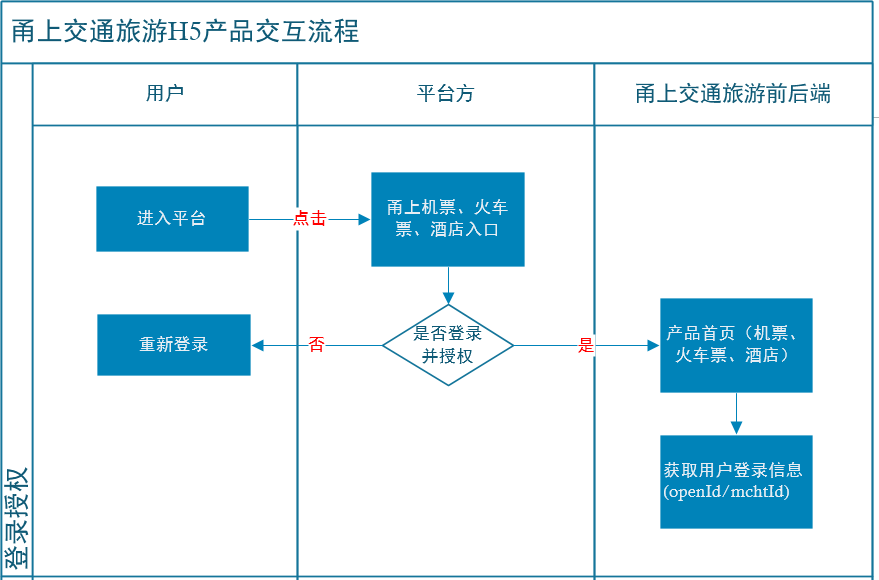
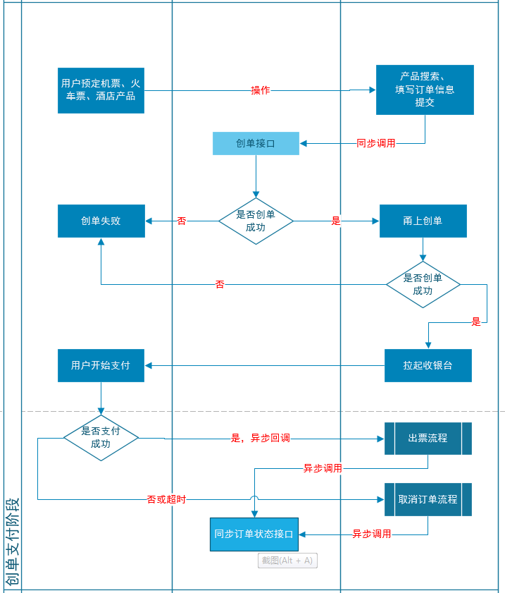
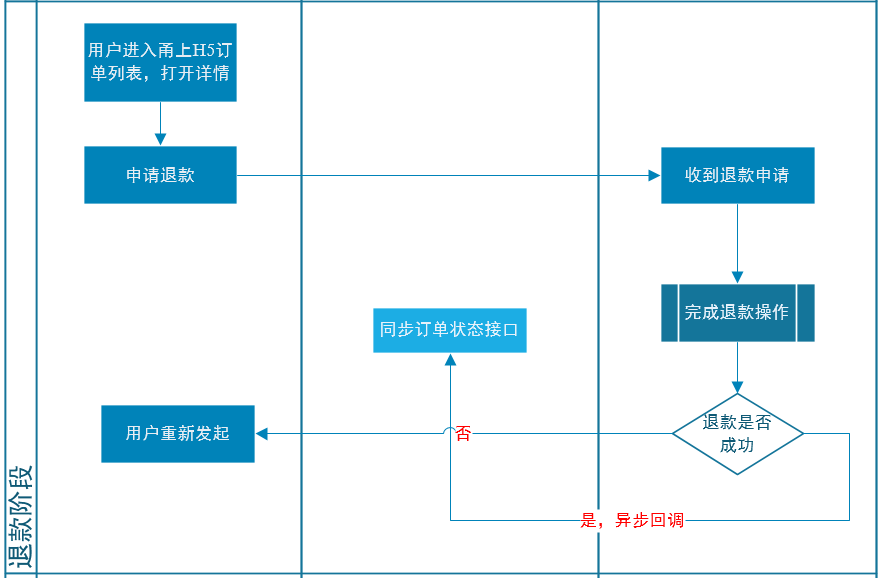
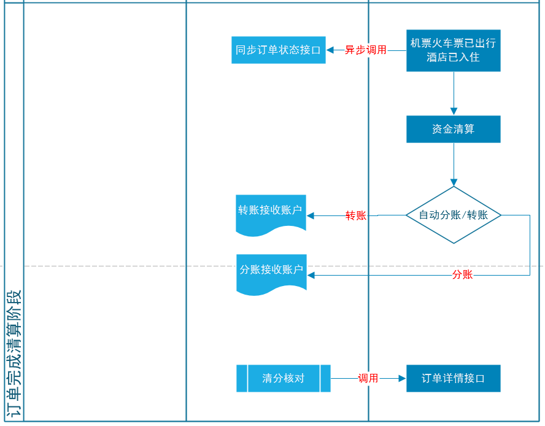

# 登录授权流程

## 流程图



## 说明

​		&emsp;&emsp;用户进入甬上提供各个产品模块（火车票、机票、酒店）的首页地址，用户在进入甬上的首页之前，需要用户登录授权，如果授权失败，则需要跳转到合作平台的登录页面。

## 授权加密方式

​		&emsp;&emsp;跳转甬上首页url例子：

​	&emsp;&emsp;	http://flighttest.yhair.cc/yhH5Index?channel=mchtName&token=Qm5JMkk0YnlubElRWDAra2pBdHhTeENWaG4vU1IzWk5uSzc1V2Y1QmhFWjdrYlhvUGdaL09DR3pkK2FZR3VrS05ncnI4bmhzWjJ4V3l5MU81M0laM1hxaUxXSVdweVVSNndHT213dW5ldXZUbTJOYTNTUWtXaGR1VFZQd01sSTlmell4dTkrSGhodnJjR3IwazJacnBKaGRERUxJVzJ0REFsM0FUcFlmalhXaklFNXN6VkpjdXpGb1A2YXF6RG8vbktrcDE5Ykd4MTcvNm9Ga0tBb0h1V0k0QzN0WGF1VnBhemdnb3NhQWFrNnVqYWlaTmwxYjgrVk0ybVNWaHNTS2kyL1A2cU1vUEVRdnprd0lwSytaNHNlbU1oa0pLK3RERGV1MmFJRXBWU0UzMXE4VS9NZmJETGNjc29SbzlpQXhRZ0dxUXY5Y3dQSTFDZ0JreUJ0Z0N3PT0=

​		&emsp;&emsp;平台需要的参数是channel 和 token,当甬上前端收到token后，会先用base64解密，再用平台提供的公钥进行rsa解密，解密出来的明文为json字符串，格式如下：

| 字段            | 必填 | 类型   | 说明                                       |
| --------------- | :--- | ------ | ------------------------------------------ |
| openId          | Y    | String | 用户唯一身份标志                           |
| shareUserId     | N    | String | 用户分享人ID                               |
| mchtId          | N    | String | 渠道商户编码                               |
| mchtName        | N    | String | 渠道商户名称                               |
| showCommission  | N    | int    | 是否展示佣金<br>0 不展示<br>1  展示        |
| commissionLevel | N    | String | 佣金级别                                   |
| ext             | N    | String | 平台方需要额外传的字段，<br>以json方式传入 |

示例：

```json
{
     "openId":"3a3ad9f9asdf0asdf0asdfx",
     "shareUserId":"fxs1230a312354asaf",
     "mchtId":"9527001",
     "mchtName":"天天旅行社",
     "showCommission":0,
     "commissionLevel":1,
     "ext":""
}
```

## 授权登陆接口

**请求地址：** http://47.101.155.28:10021/facade/saas/checkToken

**请求方式：** POST

**入参说明**

| 字段                           | 必填                     | 类型                          | 说明                            |
| :----------------------------- | :----------------------- | :---------------------------- | :------------------------------ |
| <font color=red>channel</font> | <font color=red>Y</font> | <font color=red>String</font> | <font color=red>合作平台</font> |
| token                          | Y                        | String                        | 验证口令                        |

**入参示例**

```json
{
    "user":"yinghang",
    "timestamp":1581243174061,
    "sign":"8adbb13d1b4273551dd9a3acbc602e6d",
    "data":{
        "channel":"yinghang",
    "token":"UTtptGyObjdFYzxZyh9NT1Ru0ZuobLjohUooclyfj8sf1LTMIYj5VliXwk+k1hrywmuypBfISrERmGEQ+FC5hCELcly/dhVSpTGOyC1m9GFOGphPyZJ0S4zHamP/A48TbxaDasMVGzqzSwuxtsupwPmg7Yaa2ssG/cL6FRsAGEQ="
    }
}
```

**返回说明**

| 字段            | 必填 | 类型   | 说明                                |
| :-------------- | :--- | :----- | :---------------------------------- |
| commissionLevel | N    | String | 佣金级别                            |
| mchtName        | N    | String | 渠道商户名称                        |
| openId          | Y    | String | 用户唯一身份标志                    |
| mchtId          | N    | String | 渠道商户编码                        |
| showCommission  | N    | int    | 是否展示佣金<br>0 不展示<br>1  展示 |
| shareUserId     | N    | String | 用户分享人ID                        |

**返回示例**

```json
{
    "code": 200,
    "msg": null,
    "data": {
        "commissionLevel": null,
        "mchtName": null,
        "openId": "123456",
        "mchtId": null,
        "showCommission": null,
        "shareUserId": null
    }
}
```


# 业务交互流程

## 预定及支付流程



​		&emsp;&emsp;注意此处的收银台既可以是甬上提供，也可以是平台提供；

​		&emsp;&emsp;如果平台提供了收银台，那么调用平台创单接口的时候，需要返回收银台的url给甬上，并且甬上需要提供支付回调接口地址。

​		&emsp;&emsp;甬上出票后，调用平台的同步订单状态接口，告知已出票。

​		&emsp;&emsp;甬上的订单超时取消，或者用户点击取消，可以调用平台的同步状态接口。

## 退款流程



## 机票、火车票改签流程


## 订单完成清算流程



甬上后端

## 业务说明

​			&emsp;&emsp;用户提交订单的时候，我们需要在平台创单；如果不提供，我们就不在平台创单，并且不同步订单状态。甬上的创单完成后，根据结果来拉起收银台，收银台为甬上的收银台，如果是微信内的，拉起微信JSAPI收银台；如果是微信外部浏览器，则会拉起微信H5支付和支付宝支付通道。支付回调等异步操作在甬上的后端系统里操作。

​			&emsp;&emsp;当用户支付后，甬上进行出票流程，出票完成后，甬上根据订单号同步订单状态给平台。如果用户手工取消、或者超时支付，订单也会被取消。取消后，甬上也会根据订单号同步给平台。

​			&emsp;&emsp;调用创建订单的操作为同步操作，订单状态同步的操作为异步操作。

​			&emsp;&emsp;提供订单详情接口供拉单，主订单状态、子订单状态、退款金额等，可通过拉单来获取。

## 平台创建订单接口

**请求地址：** http://47.101.155.28:10021/facade/saas/createOrder

**请求方式：** POST

**入参说明**

| 字段                                      | 必填                     | 类型                                | 说明                                                         |
| :---------------------------------------- | :----------------------- | :---------------------------------- | :----------------------------------------------------------- |
| <font color=red id="source">source</font> | <font color=red>N</font> | <font color=red>String</font>       | <font color=red>创单来源<br>android<br>ios<br>wechat</font>  |
| <font color=red>channel</font>            | <font color=red>Y</font> | <font color=red>String</font>       | <font color=red>合作平台</font>                              |
| orderNumber                               | Y                        | String                              | 甬上订单号                                                   |
| openId                                    | Y                        | String                              | 用户唯一身份标志                                             |
| shareUserId                               | N                        | String                              | 用户分享人ID                                                 |
| mchtId                                    | N                        | String                              | 渠道商户编码                                                 |
| mchtName                                  | N                        | String                              | 渠道商户名称                                                 |
| totalPrice                                | Y                        | int                                 | 订单用户总付款金额（单位分）<br>totalPrice = totalSubOrderPrice + orderLevelMoney |
| totalSettlePrice                          | N                        | int                                 | 甬上与平台订单总结算金额（单位分）<br>totalSettlePrice = 子订单settlePrice之和 + orderLevelMoney |
| totalSubOrderPrice                        | Y                        | int                                 | 子订单用户总付款金额（单位分）<br>totalSubOrderPrice = 子订单**subOrderItemMoney**之和<br>+子订单subItemPrice之和 |
| <font color=red>totalDiscountPrice</font> | <font color=red>Y</font> | <font color=red>Int</font>          | <font color=red>子订单用户总优惠金额（单位分）<br>totalDiscountPrice= 子订单discountPrice之和</font> |
| commissionLevel                           | N                        | String                              | 佣金级别                                                     |
| totalCommission                           | Y                        | int                                 | 总佣金（单位分）<br>totalCommission = 子订单commission之和   |
| orderLevelMoney                           | Y                        | int                                 | 订单维度的金额，如机票的行程单费用，<br>等于各个子订单里的**subOrderItemLevelMoney**之和。 |
| requestIp                                 | Y                        | String                              | IP地址                                                       |
| linkOrderNumber                           | N                        | String                              | 关联订单号（当机票、火车票发生了改签，<br>创建了新的订单，则这里填写之前的订单号） |
| linkUserName                              | Y                        | String                              | 联系人姓名                                                   |
| mobile                                    | Y                        | String                              | 联系人手机号                                                 |
| orderType                                 | Y                        | int                                 | 订单类型（1、机票 2、火车票 3、酒店）                        |
| productTitle                              | Y                        | String                              | 产品标题<br>机票标题是“出发机场-到达机场-出发日期-航班号”<br>火车票标题是“出发车站-到达车站-出发日期-车次号”<br>酒店标题是“酒店名称-入住日期” |
| productDescJson                           | Y                        | String                              | 产品描述json                                                 |
| productConfig                             | Y                        | [ProductConfigInfo](#ProductConfig) | 产品配置对象，包含了佣金、直减、加减价逻辑                   |
| subOrderList                              | Y                        | List<[SubOrderInfo](#SubOrderInfo)> | 子订单信息列表                                               |

<p id="SubOrderInfo"><strong>子订单信息 SubOrderInfo</strong></p>

| 字段                       | 必填  | 类型    | 说明                                                         |
| :------------------------- | ----- | ------- | :----------------------------------------------------------- |
| subOrderNumber             | Y     | String  | 甬上子订单单号                                               |
| subOrderDesc               | Y     | String  | 子订单描述，例如机票子订单描述是成人机票或者儿童机票；<br/>酒店子订单描述：酒店间夜 |
| passengerType              | C     | int     | 乘客类型：1.表示成人2.儿童3.学生机票火车票必须有，酒店可以没有 |
| subItemPrice               | Y     | int     | 用户购买单价(单位:分)机票火车票的票价酒店的间夜价            |
| settlePrice                | N     | int     | 甬上与平台方的结算价(单位:分)                                |
| **num**                    | **Y** | **int** | **数量（机票、火车票数量是1，酒店根据房间数实际情况而定）**  |
| **subOrderItemLevelMoney** | **Y** | **int** | **子订单维度的非票价金额，例如：机票有机建费、燃油税、保险；<br>火车票有抢票费、保险、极速出票费；<br>酒店可能存在保险；因为每个子订单这项金额可能不一样** |
| **commission**             | **N** | **int** | **佣金(单位:分)**                                            |
| **discountPrice**          | **N** | int     | **优惠金额(单位:分)**                                        |
| userName                   | C     | String  | 乘客姓名（酒店没有，机票火车票必须有）                       |
| cardType                   | C     | int     | 证件类型，1：身份证，2：护照，-1：其他                       |
| cardNo                     | C     | String  | 证件号                                                       |
| subOrderJson               | N     | String  | 子订单json字符串。                                           |

<p id="ProductConfig"><strong>产品配置ProductConfig</strong></p>

| 字段   | 必填 | 类型 | 说明                                                         |
| :----- | :--- | :--- | :----------------------------------------------------------- |
| cType  | Y    | int  | 销售价加减价配置参数1 金额加减 2百分比加减                   |
| cParam | Y    | int  | 如果cType=1,则表示分，500表示5元；<br>如果cType=2，则表示千分之几，50表示千分之五十，即5%。<br>加价减价参数，根据cType来计算，例如ctype=1，cParam=3，<br>则销售价=settlePrice+3；如果是ctype=2,cParam=0.003,<br>则销售价=settlePrice*1.003 |
| dParam | Y    | int  | 如果cType=1,则表示分，500表示5元；<br>如果cType=2，则表示千分之几，50表示千分之五十，即5%。<br> 在cParam计算完毕后，开始计算dParam 。dParam为活动补贴参数，<br>负数则表示加价，正数表示减价做活动；根据cType来计算。<br>如ctype=1则最终销售价格= settlePrice+cParam+dParam;如ctype=2<br>则最终销售价格=settlePrice*（1+cParam+dParam) |
| qType  | Y    | int  | 店主佣金配置参数1 金额 2百分比                               |
| qParam | Y    | int  | 如果qType=1,则表示分，500表示5元；<br>如果qType=2，则表示千分之几，50表示千分之五十，即5%。<br> 只能为正数，不能为负数，因为不可能让店主倒贴钱。<br>qType=1：<br> &emsp; &emsp; &emsp; &emsp; 店主的佣金=qParam；<br/>qType=2,cType=1：<br/> &emsp;&emsp;&emsp;&emsp;&emsp;店主佣金=cParam \* qParam<br/>qType=2,cType=2：<br/> &emsp;&emsp;&emsp;&emsp;&emsp;店主佣金=settlePrice \* cParam \* qParam |

**请求示例**

```json
{
    "data": {
        "orderType": 2,
        "orderNumber": "YHTYINGHANG1580612492595",
        "totalPrice": 1100,
        "openId": "123478150",
        "orderLevelMoney": 0,
        "channel": "yinghang",
        "mobile": "17521631214",
        "totalSettlePrice": 100,
        "requestIp": "127.0.0.1",
        "totalDiscountPrice": 0,
        "productConfig": {
            "cParam": 0,
            "cType": 0,
            "dParam": 0,
            "qParam": 0,
            "qType": 0
        },
        "subOrderList": [
            {
                "num": 1,
                "discountPrice": 0,
                "cardType": 1,
                "settlePrice": "100",
                "subOrderItemLevelMoney": 1000,
                "userName": "范松灿",
                "cardNo": "411082199711245411",
                "passengerType": 1,
                "subOrderNumber": 203247,
                "subItemPrice": "100",
                "commission": 0,
                "subOrderDesc": "成人火车票"
            }
        ],
        "totalCommission": 0,
        "linkUserName": "范松灿",
        "totalSubOrderPrice": 1100,
        "productTitle": "平凉-平凉南-2020-02-28-6074"
    },
    "sign": "65e2c5262c158fff9d4f12b65747b16d",
    "user": "trainback",
    "timestamp": 1582681449960
}
```

**返回说明**

| 字段                | 必填 | 类型                                      | 说明                     |
| :------------------ | :--- | :---------------------------------------- | :----------------------- |
| outOrderNumber      | Y    | String                                    | 外部订单号               |
| status              | Y    | int                                       | 创单状态 1、成功 2、失败 |
| pay_url             | N    | String                                    | 支付跳转链接             |
| subOrderMappingList | N    | List<[SubOrderMapping](#SubOrderMapping)> | 子订单号的映射关系       |

<p id="SubOrderMapping"><Strong>子订单映射关系对象SubOrderMapping</Strong></p>

| 字段              | 必填 | 类型   | 说明           |
| :---------------- | :--- | :----- | :------------- |
| subOrderNumber    | Y    | String | 甬上子订单单号 |
| outSubOrderNumber | Y    | String | 外部子订单号   |

## 订单状态同步接口

**入参说明：**

| 字段                           | 必填                     | 类型                                            | 说明                                                         |
| :----------------------------- | :----------------------- | :---------------------------------------------- | :----------------------------------------------------------- |
| <font color=red>channel</font> | <font color=red>Y</font> | <font color=red>String</font>                   | <font color=red>合作平台</font>                              |
| syncType                       | Y                        | int                                             | 1、主订单已支付待出票；<br>2、主订单已出票；<br>3、主订单出票失败；<br>4、主订单用户主动取消；<br>5、主订单超时取消；<br>6、主订单全额退款；<br>7、子订单申请退款；<br>8、子订单退款取消；<br>9、子订单退款完成；<br>10、一个订单里有多个子订单，最后一个子订单完成了退款;<br><font color=red>11、已完成（酒店已入住、机票火车票已出行）</font> |
| outOrderNumber                 | Y                        | String                                          | 外部订单号                                                   |
| orderNumber                    | Y                        | String                                          | 甬上订单号                                                   |
| refundSn                       | C                        | String                                          | 如果是退款状态，syncType是6、7、8、9、10,<br>则必须提供refundSn，refundSn唯一标识了甬上的一次退款记录。 |
| refundMoney                    | C                        | int                                             | 退款金额（单位：分）                                         |
| subOrderStatusSyncList         | C                        | List<[SubOrderStatusSync](#SubOrderStatusSync)> | 子订单状态同步列表，当syncType=2的时候必填                   |

<p id="SubOrderStatusSync"><Strong>子订单状态同步对象 SubOrderStatusSync<Strong></p>

| 字段              | 必填 | 类型   | 说明                                      |
| :---------------- | :--- | :----- | :---------------------------------------- |
| subOrderNumber    | Y    | String | 甬上子订单单号                            |
| outSubOrderNumber | Y    | String | 外部子订单号                              |
| refundStatus      | C    | int    | 退票状态：0 未退票  1、退票中 2、退票完成 |
| chgStatus         | C    | int    | 改签状态：0 未改签  1、改签中 2、改签完成 |

## 获取订单详情接口

**请求地址：** http://flighttest.yhair.cc/yhtestfacade/facade/callback/queryOrderDetail

**请求方式：** POST

**接口入参**

| 字段                           | 必填                     | 类型                          | 说明                                          |
| :----------------------------- | :----------------------- | :---------------------------- | :-------------------------------------------- |
| orderNumber                    | Y                        | String                        | 甬上订单号                                    |
| outOrderNumber                 | Y                        | String                        | 合作平台订单号                                |
| <font color=red>channel</font> | <font color=red>Y</font> | <font color=red>String</font> | <font color=red>合作平台</font>               |
| <font color=red>type</font>    | <font color=red>Y</font> | <font color=red>int</font>    | <font color=red>1 机票 2 酒店 3 火车票</font> |

申请示例

```json
{
  "user":"yinghang",
	"timestamp":1581243174061,
	"sign":"8adbb13d1b4273551dd9a3acbc602e6d",
	"data":{
		   "orderNumber":"YHTYINGHANG1580612492595",
		    "outOrderNumber":"639839726338428150",
		    "sign":"dsasdasdasdasdasdasdsa",
		    "channel":"yinghang",
	    	"type":2
	}
}  
```


**接口返回**

| 字段                                          | 必填                     | 类型                                       | 说明                                                         |
| :-------------------------------------------- | :----------------------- | :----------------------------------------- | :----------------------------------------------------------- |
| <font color=red>source</font>                 | <font color=red>N</font> | <font color=red>String</font>              | <font color=red>创单来源<br>android<br>ios<br>wechat</font>  |
| <font color=red>channel</font>                | <font color=red>Y</font> | <font color=red>String</font>              | <font color=red>合作平台</font>                              |
| orderNumber                                   | Y                        | String                                     | 甬上订单号                                                   |
| outOrderNumber                                | Y                        | String                                     | 外部订单号                                                   |
| status                                        | Y                        | int                                        | 1已创单<br>2已支付待出票<br>3已出票<br>4出票失败<br>5已取消<br>6全部退款 |
| totalRefundPrice                              | Y                        | int                                        | 总退款金额（单位分）退给用户的                               |
| totalRefundSettlePrice                        | N                        | int                                        | 总结算价退款金额（单位分）退给用户的                         |
| openId                                        | Y                        | String                                     | 用户唯一身份标志                                             |
| shareUserId                                   | N                        | String                                     | 用户分享人ID                                                 |
| mchtId                                        | N                        | String                                     | 渠道商户编码                                                 |
| mchtName                                      | N                        | String                                     | 渠道商户名称                                                 |
| totalPrice                                    | Y                        | int                                        | 订单用户总付款金额（单位分）<br>totalPrice = totalSubOrderPrice + orderLevelMoney |
| totalSettlePrice                              | Y                        | int                                        | 甬上与平台订单总结算金额（单位分）<br>totalSettlePrice = 子订单settlePrice之和 + orderLevelMoney |
| totalSubOrderPrice                            | Y                        | int                                        | 子订单用户总付款金额（单位分）<br>totalSubOrderPrice = 子订单**subOrderItemMoney**之和<br>+子订单subItemPrice之和 |
| <font color=red>**totalDiscountPrice**</font> | <font color=red>Y</font> | <font color=red>String</font>              | <font color=red>**子订单用户总优惠金额（单位分）<br> totalDiscountPrice = 子订单discountPrice之和**</font> |
| commissionLevel                               | N                        | String                                     | 佣金级别                                                     |
| totalCommission                               | Y                        | int                                        | 总佣金（单位分）totalCommission = 子订单commission之和       |
| orderLevelMoney                               | Y                        | int                                        | 订单维度的金额，如机票的行程单费用。                         |
| createIp                                      | Y                        | String                                     | IP地址                                                       |
| linkOrderNumber                               | N                        | String                                     | 关联订单号（当机票、火车票发生了改签，创建了新的订单，则这里填写之前的订单号） |
| linkUserName                                  | Y                        | String                                     | 联系人姓名                                                   |
| mobile                                        | Y                        | String                                     | 联系人手机号                                                 |
| orderType                                     | Y                        | int                                        | 订单类型（1、机票 2、火车票 3、酒店）                        |
| productTitle                                  | Y                        | String                                     | 产品标题<br>机票标题是“出发机场-到达机场-出发日期-航班号”<br>火车票标题是“出发车站-到达车站-出发日期-车次号”<br>酒店标题是“酒店名称-入住日期” |
| productDescJson                               | Y                        | String                                     | 产品描述json                                                 |
| productConfig                                 | Y                        | [ProductConfigInfo](#ProductConfig_detail) | 产品配置对象，包含了佣金、直减、加减价逻辑                   |
| subOrderList                                  | Y                        | List<[SubOrderInfo](#SubOrderInfo_detail)> | 子订单信息列表                                               |

<p id="SubOrderInfo_detail"><Strong>子订单信息 SubOrderInfo</Strong></p>

| 字段                  | 必填  | 类型    | 说明                                                         |
| :-------------------- | :---- | :------ | ------------------------------------------------------------ |
| subOrderNumber        | Y     | String  | 甬上子订单单号                                               |
| subOrderDesc          | Y     | String  | 子订单描述，例如机票子订单描述是成人机票 <br>或者 儿童机票；酒店子订单描述：酒店间夜 |
| subOrderRefundStatus  | Y     | int     | 退票状态：0 未退票  1、退票中 2、退票完成                    |
| subOrderChgStatus     | Y     | int     | 改签状态：0 未改签  1、改签中 2、改签完成                    |
| subRefundPrice        | N     | int     | 子订单退款金额（单位分：退给用户）                           |
| subRefundSettlePrice  | N     | int     | 子订单结算价金额（单位分：退给平台）                         |
| passengerType         | C     | int     | 乘客类型：1.表示成人2.儿童3.学生机票火车票必须有，酒店可以没有 |
| subItemPrice          | Y     | int     | 用户购买单价(单位:分)机票火车票的票价酒店的间夜价            |
| settlePrice           | N     | int     | 甬上与平台方的结算价(单位:分)                                |
| **num**               | **Y** | **int** | **数量（机票、火车票数量是1，酒店根据房间数实际情况而定）**  |
| **subOrderItemMoney** | **Y** | **int** | **子订单维度的非票价金额，例如：机票有机建费、燃油税、保险；<br>火车票有抢票费、保险、极速出票费；<br>酒店可能存在保险；因为每个子订单这项金额可能不一样** |
| **commission**        | **N** | **int** | **佣金(单位:分)**                                            |
| **discountPrice**     | **N** | int     | **优惠金额(单位:分)**                                        |
| userName              | C     | String  | 乘客姓名（酒店没有，机票火车票必须有）                       |
| cardType              | C     | int     | 证件类型，1：身份证，2：护照，-1：其他                       |
| cardNo                | C     | String  | 证件号                                                       |
| subOrderExt           | N     | String  | 子订单json字符串。                                           |

<p id="ProductConfig_detail"><Strong>产品配置ProductConfig</Strong></p>

| 字段        | 必填 | 类型   | 说明                                                         |
| :---------- | :--- | :----- | :----------------------------------------------------------- |
| cType       | Y    | int    | 销售价加减价配置参数1 金额加减 2百分比加减                   |
| cParam      | Y    | int    | 如果cType=1,则表示分，500表示5元；<br>如果cType=2，则表示千分之几，50表示千分之五十，即5%。<br>加价减价参数，根据cType来计算，例如ctype=1，cParam=3，<br>则销售价=settlePrice+3；如果是ctype=2,cParam=0.003,<br>则销售价=settlePrice*1.003 |
| dParam      | Y    | int    | 如果cType=1,则表示分，500表示5元；<br>如果cType=2，则表示千分之几，50表示千分之五十，即5%。<br> 在cParam计算完毕后，开始计算dParam 。dParam为活动补贴参数，<br>负数则表示加价，正数表示减价做活动；根据cType来计算。<br>如ctype=1则最终销售价格= settlePrice+cParam+dParam;如ctype=2<br>则最终销售价格=settlePrice*（1+cParam+dParam) |
| qType       | Y    | int    | 店主佣金配置参数1 金额 2百分比                               |
| qParam      | Y    | int    | 如果qType=1,则表示分，500表示5元；<br>如果qType=2，则表示千分之几，50表示千分之五十，即5%。<br> 只能为正数，不能为负数，因为不可能让店主倒贴钱。<br>qType=1：<br> &emsp; &emsp; &emsp; &emsp; 店主的佣金=qParam；<br/>qType=2,cType=1：<br> &emsp;&emsp;&emsp;&emsp;&emsp;店主佣金=cParam \* qParam<br>qType=2,cType=2：<br> &emsp;&emsp;&emsp;&emsp;&emsp;店主佣金=settlePrice \* cParam \* qParam |
| subOrderExt | N    | String | 子订单json字符串。                                           |

**返回示例**

```json
{
    "code":200,
    "msg":"",
    "data": {
        "channel": "yinghang",
        "orderNumber": "YHTYINGHANG1580612492595",
        "outOrderNumber": "32193723131",
        "status": "1",
        "totalRefundPrice": 1000,
        "openId": "123478150",
        "totalPrice": 1100,
        "totalSettlePrice": 100,
        "totalSubOrderPrice": 1100,
        "totalDiscountPrice": 0,
        "totalCommission": 0,
        "orderLevelMoney": 0,
        "createIp": "127.0.0.1",
        "linkUserName": "范松灿",
        "mobile": "17521631214",
        "orderType": 2,
        "productTitle": "平凉-平凉南-2020-02-28-6074",
        "productConfig": {
            "cParam": 0,
            "cType": 0,
            "dParam": 0,
            "qParam": 0,
            "qType": 0
        },
        "subOrderList": [
            {
                "num": 1,
                "discountPrice": 0,
                "cardType": 1,
                "settlePrice": "100",
                "subOrderItemLevelMoney": 1000,
                "userName": "范松灿",
                "cardNo": "411082199711245411",
                "passengerType": 1,
                "subOrderNumber": 203247,
                "subItemPrice": "100",
                "commission": 0,
                "subOrderDesc": "成人火车票"
            }
        ]
    }
}
```


## 订单详情跳转地址


&emsp;&emsp;&emsp;如果订单列表在平台方，甬上需要提供订单详情地址，#是需要带入的参数；如果订单列表在甬上，该地址可以不采用。

测试环境：

http://flighttest.yhair.cc/yhtestyhh5back/yhh5/orderDetail?orderId=#&token=#

生产环境：

https://yhair.cc/yhh5back/yhh5/orderDetail?orderId=#&token=#


## 甬上的支付回调接口

**请求地址：** http://flighttest.yhair.cc/yhtestfacade/facade/callback/payNotify

**请求方式：** POST

**入参说明**

| 字段           | 必填 | 类型   | 说明                               |
| :------------- | :--- | :----- | :--------------------------------- |
| orderNumber    | Y    | String | 甬上订单号                         |
| outOrderNumber | Y    | String | 合作平台订单号                     |
| type           | Y    | int    | 业务类型，3=火车票 2=酒店 1=飞机票 |

**入参示例**

```json
{
  "user":"yinghang",
	"timestamp":1581243174061,
	"sign":"8adbb13d1b4273551dd9a3acbc602e6d",
	"data":{
		   "orderNumber":"YHTYINGHANG1580612492595",
		   "outOrderNumber":"639839726338428150",
		   "sign":"dsasdasdasdasdasdasdsa",
		   "type":2
	}
}  
```

**返回说明**

| 字段 | 必填 | 类型 | 说明                |
| :--- | :--- | :--- | :------------------ |
| code | Y    | int  | 200=成功 非200=失败 |

**返回示例**

```json
{
    "code":200,
    "msg":"",
    "data":"",
}
```


## 甬上的退款回调接口

**请求地址：** http://flighttest.yhair.cc/yhtestfacade/facade/callback/refundNotify

**请求方式：** POST

**入参说明**

| 字段           | 必填 | 类型   | 说明                               |
| :------------- | :--- | :----- | :--------------------------------- |
| refundSn       | Y    | String | 退款序列号（甬上唯一标识一次退款） |
| orderNumber    | Y    | String | 甬上订单号                         |
| outOrderNumber | Y    | String | 合作平台订单号                     |
| subOrderNumber | Y    | String | 甬上退款子订单单号                 |
| status         | Y    | int    | 状态1、成功2、失败                 |
| refundMoney    | Y    | int    | 退款金额（单位：分）               |
| type           | Y    | int    | 业务类型，3=火车票 2=酒店 1=飞机票 |

**入参示例**

```json
{
  "user":"yinghang",
	"timestamp":1581243174061,
	"sign":"8adbb13d1b4273551dd9a3acbc602e6d",
	"data":{
		   "refundSn":"312312545732",
       "orderNumber":"YHTYINGHANG1580612492595",
		   "outOrderNumber":"639839726338428150",
       "subOrderNumber":"YHTYINGHANG1580612492595",
		   "sign":"dsasdasdasdasdasdasdsa",
       "status":1,
       "refundMoney":1100,
		   "type":2
	}
}  
```

**返回说明**

| 字段 | 必填 | 类型 | 说明                |
| :--- | :--- | :--- | :------------------ |
| code | Y    | int  | 200=成功 非200=失败 |

**返回示例**

```json
{
    "code":200,
    "msg":"",
    "data":"",
}
```


## 平台方的订单状态查询接口

**入参说明**

| 字段           | 必填 | 类型   | 说明                               |
| :------------- | :--- | :----- | :--------------------------------- |
| orderNumber    | Y    | String | 甬上订单号                         |
| outOrderNumber | Y    | String | 合作平台订单号                     |
| type           | Y    | int    | 业务类型，3=火车票 2=酒店 1=飞机票 |

**返回说明**

| 字段   | 必填 | 类型 | 说明                                                         |
| :----- | :--- | :--- | :----------------------------------------------------------- |
| status | Y    | int  | 1、待支付<br>2、已支付<br>3、已出票（已发货）<br>4、出票失败（已取消）<br>5、已取消<br>6、已退款 |

## 平台方的退款状态查询接口

**入参说明**

| 字段           | 必填 | 类型   | 说明                               |
| :------------- | :--- | :----- | :--------------------------------- |
| refundSn       | Y    | String | 退款序列号（甬上唯一标识一次退款） |
| orderNumber    | Y    | String | 甬上订单号                         |
| outOrderNumber | Y    | String | 合作平台订单号                     |
| type           | Y    | int    | 业务类型，3=火车票 2=酒店 1=飞机票 |

**返回说明**

| 字段        | 必填 | 类型   | 说明                                                   |
| :---------- | :--- | :----- | :----------------------------------------------------- |
| status      | Y    | int    | 1、未退款<br>2、退款中<br/>3、退款完成<br/>4、退款失败 |
| refundMoney | Y    | int    | 退款金额（单位：分）                                   |
| refundTime  | Y    | String | 退款时间 yyyy-MM-dd HH:mm:ss                           |

## 佣金加价参数的说明

&emsp;&emsp;cParam用来配置销售价格的加价，目的是创建毛利空间；

&emsp;&emsp;dParam用来在cParam配置的销售价格上进行减价，得到最终销售价格，目的是为了做活动；

&emsp;&emsp;qParam是用来获取店主的佣金，店主的佣金是根据cParam创建出来的空间，根据qParam进行计算。

&emsp;&emsp;甬上和平台之间以票价结算价作为基准，假设结算价是1000，cType=1：

&emsp;&emsp;平台配置了cParam=10，那么此时的销售价格是1010，平台得到了10元的毛利空间。平台开始做活动，配置了dParam=3，则最终销售价格是1010-3=1007，做了3元的直减。用户购买的时候以1007的价格进行了购买。

&emsp;&emsp;店主的佣金配置，假设平台配置了qType=2，qParam=500,则表示店主活得毛利空间的50%，则店主佣金= 10*50%=5元。

## 自动分账的说明

&emsp;&emsp;自动分账是指订单在完成后，实现双方的自动分润。订单完成是指未退款或者未全额退款的机票、火车票订单已出行，未退款或者未全额退款的酒店订单已入住。自动分账由微信、支付宝的相关接口自动进行，适用于收银台是甬上的订单。如果收银台不是甬上的收银台，则不能实现实时的自动分账。

&emsp;&emsp;当订单完成后，甬上的后端服务会调用微信、支付宝对应支付订单的分账接口，相应的分佣就会自动进入平台方提供的资金账户。

# 接口公共说明

## 参数格式

* 入参出参均为json

* 编码格式统一为utf-8

* 请求类型为application/json

## 通用请求参数

通用请求参数为所有接口调用时都必须传的参数

| 参数名称 | 类型   | 必填 | 描述     | 备注 |
| -------- | ------ | ---- | -------- | ---- |
| sign     | String | 是   | 加密签名 |      |

## 签名算法

&emsp;&emsp;调用API 时需要对请求参数进行签名验证，服务器也会对该请求参数进行验证是否合法的。 方法如下：

&emsp;&emsp;&emsp;&emsp;(1)根据参数名称将所有请求参数按照字母先后顺序排序:key + value .... key + value；

&emsp;&emsp;例如：将foo=1,bar=2,baz=3 排序为bar=2,baz=3,foo=1，参数名和参数值链接后，得到拼装字符串bar2baz3foo1。

&emsp;&emsp;注意：如果有复杂对象，比如列表，也需要对列表对象根据参数名称将所有请求参数按照字母先后顺序排序。

&emsp;&emsp;&emsp;&emsp;(2)md5：将secret 拼接到参数字符尾， 进行md5散列后，再转化成小写；注意这里只能使用MD5的32位加密。

# 双方需要提供配置参数

## 平台方提供参数

| 序号 | 参数                                   | 说明                                                         |
| :--- | :------------------------------------- | :----------------------------------------------------------- |
| 1    | 授权登录接口publicKey                  | 授权登录时，甬上根据publicKey进行解码                        |
| 2    | 授权失败跳转URL                        | 解码失败后跳转的地址，如果没有的话我们也会提供一个跳转失败说明的网址。 |
| 3    | 是否提供订单列表                       | 订单列表可以在甬上，也可以在平台方；如果在平台方，用户提供甬上需要提<br>供订单详情地址。 |
| 4    | 是否提供收银台                         | 如果不提供收银台，甬上提供微信、支付宝的收银台，资金流水从甬上走。甬上<br>提供报表后台供平台方使用。 |
| 5    | 是否提供创单接口                       | 如果不提供创单接口，则没有后续的订单同步；订单数据在甬上的报表即可导入。 |
| 6    | 是否提供短信接口                       | 如果需要短信，请单独提供短信接口给甬上；如果没有，就使用甬上的短信接口； |
| 7    | 是否提供退款完成回调接口               | 如果收银台是甬上收银台，则不需要提供；                       |
| 8    | 是否提供退款状态查询和订单状态查询接口 | 如果收银台是甬上收银台，则不需要提供；                       |
| 9    | 是否创建退款单                         | 如果平台需要创建退款单，则甬上在创建退款单的时候，就需要同步退款单数据，<br>平台方需要在订单状态同步接口中，返回平台的退款单的唯一标识outRefundSn。 |
| 10   | 创建订单接口URL                        | 创建订单接口URL                                              |
| 11   | 订单同步接口URL                        | 订单同步接口URL                                              |
| 12   | 订单状态查询接口URL                    | 订单状态查询接口URL                                          |
| 13   | 退款状态查询接口URL                    | 退款状态查询接口URL                                          |
| 14   | 佣金、直减参数                         | 是否有佣金参数模式；是否有活动直减模式；如果有，相关佣金、直减参数同步给甬上的运营 |
| 15   | 自动分账的接收支付宝、微信账号         | 如果收银台是甬上，并且是自动分账模式，则平台方需要提供自动分账的账号。 |

## 甬上需要提供的参数

| 序号 | 参数                            | 说明                                             |
| :--- | :------------------------------ | :----------------------------------------------- |
| 1    | 机票、火车票、酒店产品的首页URL | 可以集成也可以分开提供                           |
| 2    | 订单详情H5地址URL               | 如果平台方有自己的订单列表，我们提供订单详情嵌入 |
| 3    | 订单详情接口URL                 | 提供拉单接口，供平台方调用；                     |
| 4    | 支付回调接口URL                 | 如果收银台是平台的，我们提供支付回调接口；       |
| 5    | 退款回调接口URL                 | 如果收银台是平台的，我们提供支付回调接口；       |
| 6    | 后台报表系统                    | 提供每一笔订单的流水和汇总；                     |
| 7    | 短信服务                        | 出票、改签、退款等流程发送短信给用户；           |